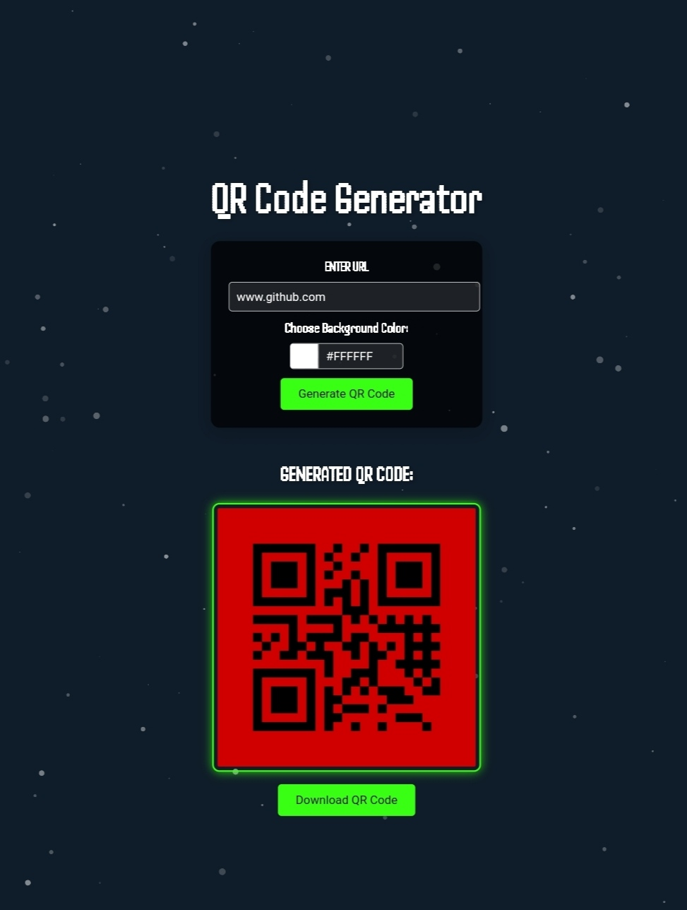

<!DOCTYPE html>
<html>

<head>
    <title>QR Code Generator using Flask</title>
</head>

<body>

<h1>QR Code Generator using Flask</h1>

This is a simple QR Code generator web application built using Flask. It allows you to generate QR codes with custom foreground and background colors.

<h2>Prerequisites</h2>
<ul>
    <li>Python 3.x</li>
    <li>Flask</li>
    <li>qrcode</li>
    <li>Pillow</li>
</ul>

<h2>Installation</h2>

<ol>
    <li>Clone this repository:</li>
</ol>

<pre><code>git clone https://github.com/your-username/qr-code-generator-flask.git
cd qr-code-generator-flask</code></pre>

<ol start="2">
    <li>Install the required dependencies:</li>
</ol>

<pre><code>pip install Flask qrcode pillow</code></pre>

<h2>Usage</h2>

<ol>
    <li>Run the Flask application:</li>
</ol>

<pre><code>python app.py</code></pre>

<ol start="2">
    <li>Open your web browser and navigate to <a href="http://localhost:5000/">http://localhost:5000/</a>.</li>
    <li>Fill in the URL and choose the foreground and background colors for the QR code.</li>
    <li>Click the "Generate QR Code" button to create the QR code.</li>
</ol>

<h2>Screenshots</h2>

<h2>How It Works</h2>

The core of the application is in the <code>app.py</code> file. It uses the Flask framework to handle requests and generate QR codes. The <code>generate_qr_code</code> function takes a URL, foreground color, and background color as input and returns a base64-encoded PNG image of the generated QR code.

<pre><code><!-- Paste the Python code here --></code></pre>

<h2>Contributing</h2>

Contributions are welcome! If you find any issues or want to improve the application, feel free to open a pull request.

<h2>License</h2>

This project is licensed under the MIT License - see the <a href="LICENSE">LICENSE</a> file for details.

</body>

</html>
